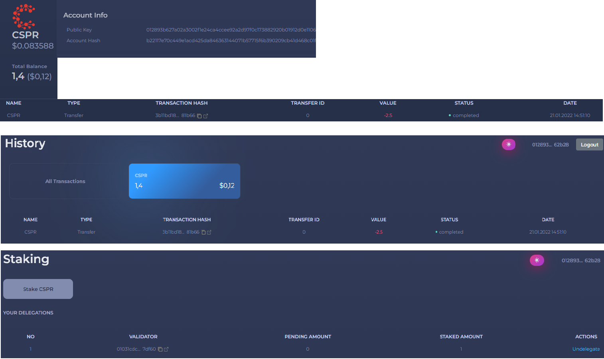

Grant Proposal | [286 - casperdash.io wallet ( web, extension, mobile app )](https://portal.devxdao.com/public-proposals/286)
------------ | -------------
Milestone | 1
Milestone Title | Web wallet - Submission 1
OP | Kien Nguyen
Reviewer | Ekin Keçeci <ekin@ekonteknoloji.com>
# Milestone Details

## Details & Acceptance Criteria

**Details of what will be delivered in milestone:**

- Control of Integration with Casper Singer
- Control of Dashboard
  - View CSPR balance
  - Send/Receive CRPR
  - CRPS price chart
- Control of Tokens
  - View token info/balance
  - Send/Receive tokens
  - Add custom token by contract hash
- Control of History
  - View transfer transactions history
- Control of Stacking  
- Control of NFT 
   
**Acceptance criteria:**

- Release a stable version working on mainnet with feature 

## Milestone Submission

The following milestone assets/artifacts were submitted for review:

Repository | Revision Reviewed
------------ | -------------
https://github.com/CasperDash/casperdash-client/tree/v1.0.0 | ade2cbf

# Install & Usage Testing Procedure and Findings
Following the instructions in the README of https://github.com/CasperDash/casperdash-client/tree/v1.0.0 and https://github.com/CasperDash/casperdash-api, the reviewer was able to successfully install the library. The reviewer was also able to successfully build the source code for this milestone by using the build script furnished in the root and readme of the repository.

Pages (Dashboard , History , Stacking , NFT and Token) on the website are working properly.

## Overall Impression of usage testing

The code was very well laid out and pretty printed for easy reading. Things were aligned nicely and it was easy to understand what was happening in the libraries as everything was also named very appropriately. Project successfully compiled and run.

Requirement | Part | Finding
------------ | ------------- | -----------
                                  
                                   Casper signer integration test | PASS
                                   
                                   Control to View CSPR balance | Dashboard | PASS
                                   Control to Send/Receive CRPR | Dashboard | PASS
                                   Control to CRPS price chart  | Dashboard | PASS
                                   
                                   Control to Stacking Operations | Staking |PASS
                                   
                                   Control to View transfer transactions history | History | PASS
                                   
                                   Control to View token info/balance | Token | PASS
                                   Control to Send/Receive tokens | Token | PASS
                                   Control to Add custom token by contract hash | Token | PASS
                                   
                                   Control to View NFTs | NFT | PASS
                                   
                                   
# Documentation

### Code Documentation

Reviewer observed that all critical functions of the project had low-level code documentation which could be used for automated documentation generation.

Requirement | Finding
------------ | -------------
Code Documented | PASS

### Project Documentation

The reviewer observed that the README of the project has detailed general and usage documentation.

Requirement | Finding
------------ | -------------
Usage Documented | PASS

## Overall Conclusion on Documentation

The reviewer concludes that the project has sufficient comprehensive general documentation. 

# Open Source Practices

## Licenses

The Project is released under the MIT License

Requirement | Finding
------------ | -------------
OSI-approved open source software license | PASS

## Contribution Policies

File not found. The project does not contain a CONTRIBUTION policy.

Requirement | Finding
------------ | -------------
OSS contribution best practices | FAIL

# Coding Standards

## General Observations

The coding is well structured and readable. Github site setup is easy and successful.

# Final Conclusion
Overall, the project was well prepared. The documentation and the process are well explained and the project can be started easily. however, there were difficulties as the milestones were not clearly explained. The reviewer may find it difficult to understand. More details are suggested.
# Recommendation

Recommendation | PASS
------------ | -------------
